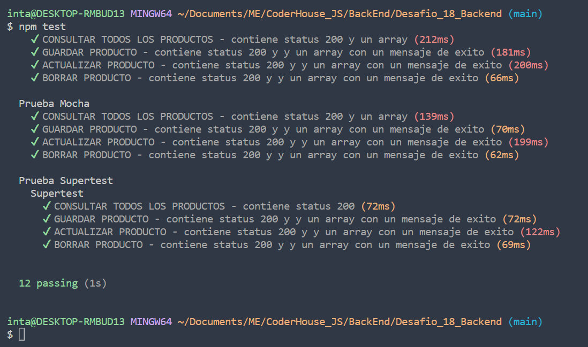

# **Desafío: TESTEAMOS NUESTRA API REST**. Curso CoderHouse Backend Node.Js

## Consignas:

* Revisar en forma completa el proyecto entregable que venimos realizando, refactorizando y reformando todo lo necesario para llegar al esquema de servidor API RESTful en capas planteado en esta clase.
* Asegurarse de dejar al servidor bien estructurado con su ruteo / controlador, negocio, validaciones, persistencia y configuraciones (preferentemente utilizando en la codificación clases de ECMAScript).
* No hace falta realizar un cliente ya que utilizaremos tests para verificar el correcto funcionamiento de las funcionalidades desarrolladas.
* Desarrollar un cliente HTTP de pruebas que utilice Axios para enviar peticiones, y realizar un test de la funcionalidad hacia la API Rest de productos, verificando la correcta lectura de productos disponibles, incorporación de nuevos productos, modificación y borrado.
* Realizar el cliente en un módulo independiente y desde un código aparte generar las peticiones correspondientes, revisando los resultados desde la base de datos y en la respuesta del servidor obtenida en el cliente HTTP.
* Luego, realizar las mismas pruebas, a través de un código de test apropiado, que utilice mocha, chai y Supertest, para probar cada uno de los métodos HTTP de la API Rest de productos.
* Escribir una suite de test para verificar si las respuestas a la lectura, incorporación, modificación y borrado de productos son las apropiadas. Generar un reporte con los resultados obtenidos de la salida del test

## Como ejecutar el proyecto de manera local:

* Ejecutar el comando `npm install`
* Se debe crear un archivo de configuraracion `.env` con los siguientes datos

```
MONGO_USER = "<usuario Mongo Atlas>"
MONGO_PASS = "<contraseña Mongo Atlas>"
MONGO_CLUSTER = "<@clusterx.asd123.mongodb.net/test>"
GOOGLE_APLICATION_CREDENTIALS = "<google credentials>"
PUERTO = 8080

ACCOUNT_SID = ""
AUTH_TOKEN = ""
NRO_WSP = "<número whatsapp aporbado para recibir mensajes>"
NRO_TWILIO = "<número de twilio>"

TEST_MAIL = "<cuenta de correo gmail>"
TEST_MAIL_PASS = "<contraseña correo prueba>"
```

* Ejecutar el comando `npm run start` o ` npm run start -- --puerto <n° de puerto>`
* Para probar/testear los diferentes rutas y funcionalidades, se recomienda utilizar [Postman](https://www.postman.com/downloads/)´
  
## Resultado de las pruebas:
* 
